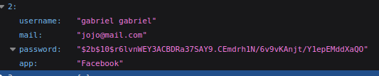
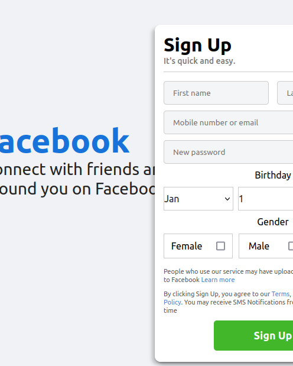
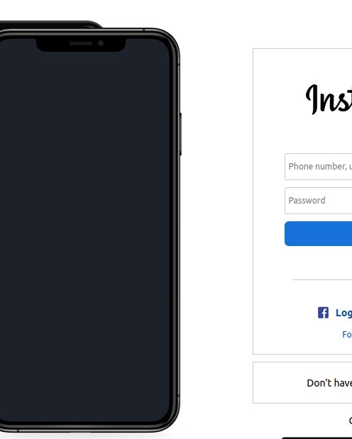

# Social Pages

Projeto em Angula, o intuito foi criar uma cópia da interface de algumas das principais páginas da web, o Google, o Twitter, o Facebook e o Instagram.

O projeto utilizou Angular para o front-end e Node para o backend, foi implementado funcionalidades de cadastro de conta e login para cada página. O formato do usuário no back-end está como:

```
{
    username: "nome"
    mail: "email@mail.com"
    password: "criptografada"
    app: "App usado"
}
```

Para a criptografia de senha foi usado o bycript.

# Executando o projeto

Existem duas formas para executar o projeto, a primeira é simplesmente abrir o script disponível na pasta do projeto. 
```social-pages/start_server.sh```

A segunda maneira é indo na pasta **backend**, em seguida digitar o comando ```node index.js``` no terminal. Depois, na pasta social-pages, deve digitar ```ng serve```. Assim os servidores se iniciarão.

## Acessando a página

Após execultar o projeto, e deixar o terminal aberto, o usuário deve ir no navegador e acessar o link ```http://localhost:4200/```

## Imagens do projeto






